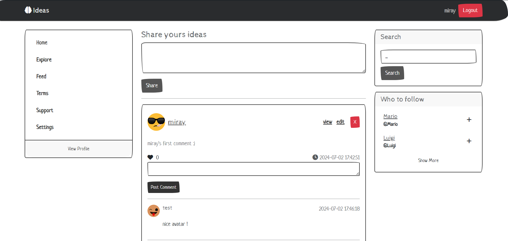
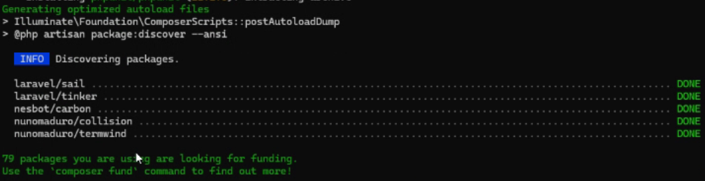

# Ideas: Twitter Clone

A simple Twitter clone website that allows users to sign up and log in.
They could then create and post short ideas (messages), similar to tweets.
The main page, currently, displays all ideas with comments from registered users.
This core functionality provides a basic social media experience.



---

## Table of contents

* [Technologies](#technologies-used)
* [Setup](#installation-and-setup-on-windows-os)
* [Features](#features)

---

## Technologies Used

**Framework:** Laravel

**Database:** MariaDB

**ORM:** Eloquent

**Template Language:** Blade

---

## Installation and setup on Windows OS

### 0. (optional) Make sure ports 8000 and 3306 are free. Repeat the steps for both ports:

1. Open cmd terminal as administrator and run:

```cmd
netstat -ano | findstr :3306
```
* If there is no output means there is no process running on that port
* In that case, skip the following steps

2. If there is any output means a process is running on that port

3. Copy the last number from the output and stop the process:

```cmd
taskkill /PID number_here /F
```


### 1. Make sure that you have installed:

[XAMPP](https://www.apachefriends.org/)  
[Composer](https://getcomposer.org/)

* And start MySQL server from the XAMPP Control Panel:

### 2. Make sure that you have php, mysql and composer in system path variables:

C:\xampp\php  
C:\xampp\mysql\bin  
C:\ProgramData\ComposerSetup\bin

* Adjust the paths to your specific ones if needed

### 3. Open a terminal in a folder and clone the project:

```
git clone https://github.com/miray-mustafov/ideas.git
```

* navigate the terminal to ideas folder:

```
cd ideas
```

### 4. Install the dependency manager in the project:

```
composer install
```
* Make sure that you wait for the full installation:


### 5. Create .env file at root level. Paste all the content from .env.example:

```cmd
copy .env.example .env
```

### 6. Generate APP_KEY for the .env file:

```
php artisan key:generate
```

### 7. Link public with storage folder:

```
php artisan storage:link
```

### 8. Create database ideas in MySQL server:

1. If mysql is correctly added to the system path variables, connect to the server with:
``` 
mysql -u root
```
2. Create ideas database with:
```
create database ideas;
```

3. Ctrl+C to exit the database server

### 9. Apply the migrations to the database

```
php artisan migrate
```

### 10. Run the server:

```
php artisan serve
```

* And visit the website shown on the output

---

## Features:

- **Users**
    * Profile view
    * Registration
    * Login/Logout


- **Ideas/Tweets**
    * Idea View
    * Creation with validations
    * Update: owner can update
    * Deletion: owner can delete


- **Comments**
    * Creation

* authentication middleware is added to most of the routes
  to ensure that a logged-in user uses the key functionality
* flash messages for success
* pagination
* simple search functionality
